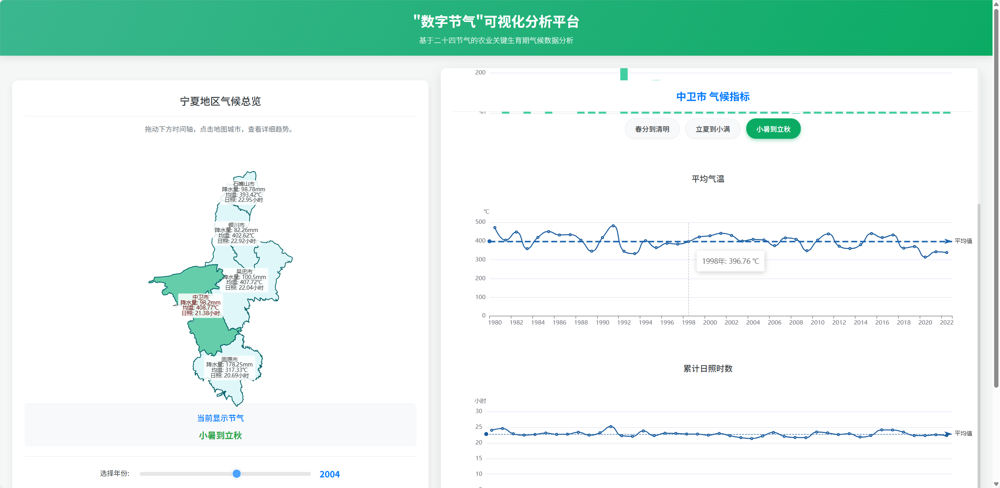
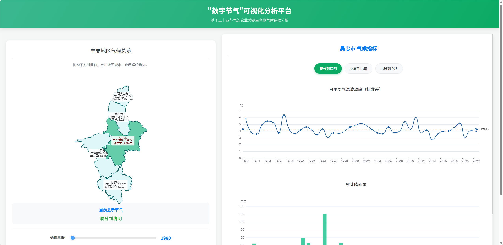
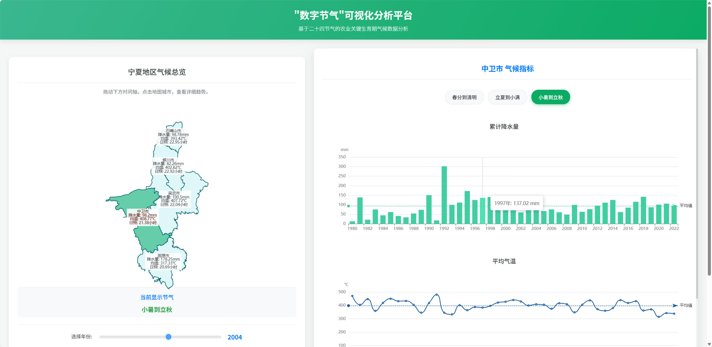
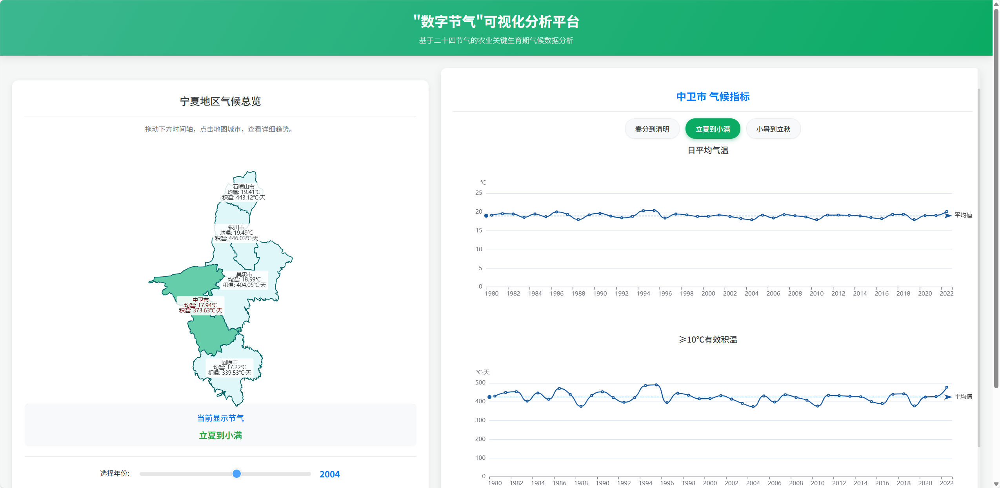

<div align="center">

# Digital Solar Terms

**Exploring multi-decade climate change through the rhythm of China's traditional solar-term calendar.**

`JavaScript` · `ECharts` · `Climate data engineering` · `Time-series analysis`

</div>

<p align="center">
  
</p>

<table>
<tr>
<td width="50%"></td>
<td width="50%"></td>
</tr>
<tr>
<td colspan="2"></td>
</tr>
</table>

Digital Solar Terms reorganises daily weather records into comparable solar-term windows. Instead of treating a calendar month as a fixed seasonal unit, the platform follows the changing dates of each solar term and lets users compare the same agricultural window across more than four decades.

## Highlights

- **Five Ningxia cities, 1980–2022** across temperature, precipitation, sunshine and effective-temperature indicators.
- **Three crop-relevant solar-term windows** covering spring, summer and autumn growth stages.
- **Linked visual analysis** combining a choropleth map, city drill-down, year timeline and trend-to-detail interaction.
- **Forward view to 2030** with projected climate trends and quality bands.
- **Single-page delivery** through a self-contained ECharts application with inlined map topology.

## Explore the platform

The interface supports three connected questions:

1. How does one solar-term window differ across cities?
2. How has the same city changed from 1980 to 2022?
3. Which climate factors are most influential during each agricultural stage?

Clicking a trend point returns the map and detail panels to the selected year, allowing geographic and longitudinal views to stay synchronised.

## Data pipeline

```text
daily station records
        │
        ▼
missing-value interpolation
        │
        ▼
solar-term window assignment
        │
        ▼
city × year aggregation
        │
        ├────────► linked ECharts views
        └────────► projection and quality analysis
```

The model-ready vector contains seven seasonal values per city-year:

```text
spring_tempVar · spring_precip · summer_avgTemp · summer_effTemp
autumn_precip · autumn_avgTemp · autumn_sunshine
```

Window definitions, interpolation and aggregation are documented in [`docs/data-pipeline.md`](docs/data-pipeline.md). The repository also includes sample long-format exports for Shandong and Xinjiang sunshine records.

## Modelling

- **Climate projection:** Prophet models the annual trend, while bootstrapped historical residuals restore realistic year-to-year variation.
- **Climate-to-quality prototype:** a random-forest utility demonstrates how the seven seasonal factors can be mapped to an agricultural quality indicator.
- **Integrated display:** the published page combines the climate series with quality outputs produced by the companion agricultural climate-quality system.

## Run locally

```bash
python -m http.server 8000
```

Open `http://localhost:8000/index.html`.

The main visualisation is self-contained. To inspect the earlier step-by-step conversion workflow:

```bash
python scripts/convert_data.py
```

## Project context

**Role:** Primary Developer for the data pipeline and visualisation in a team entry, completed from April to May 2025.

The project received a **National Second Prize** in the 19th Challenge Cup AI+ Special Contest and supported two software copyright registrations.

Map boundaries are based on Alibaba DataV GeoAtlas and are used for display only.

## License

Copyright © 2026 Shixiang Liu. See [LICENSE](LICENSE) for portfolio and evaluation terms.
